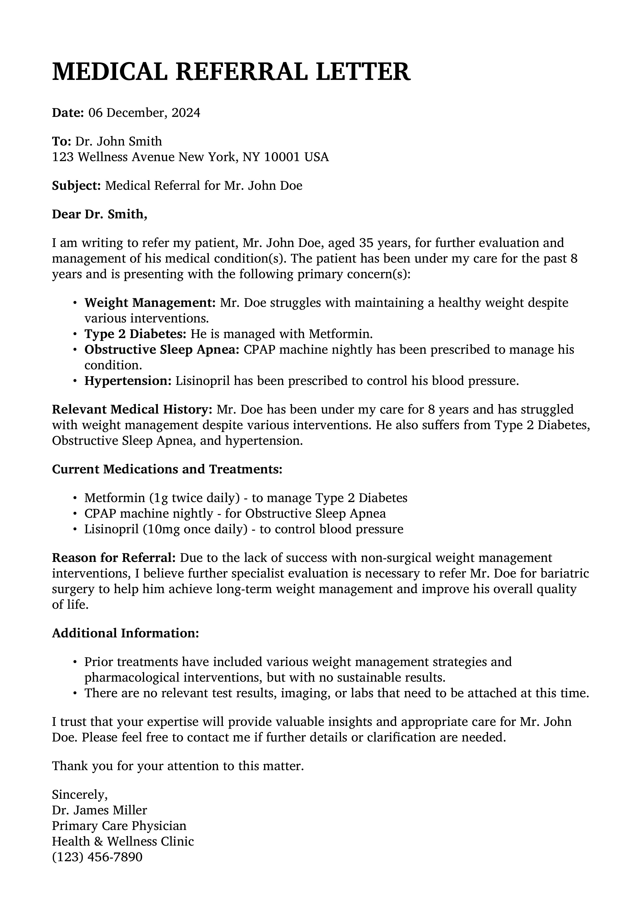
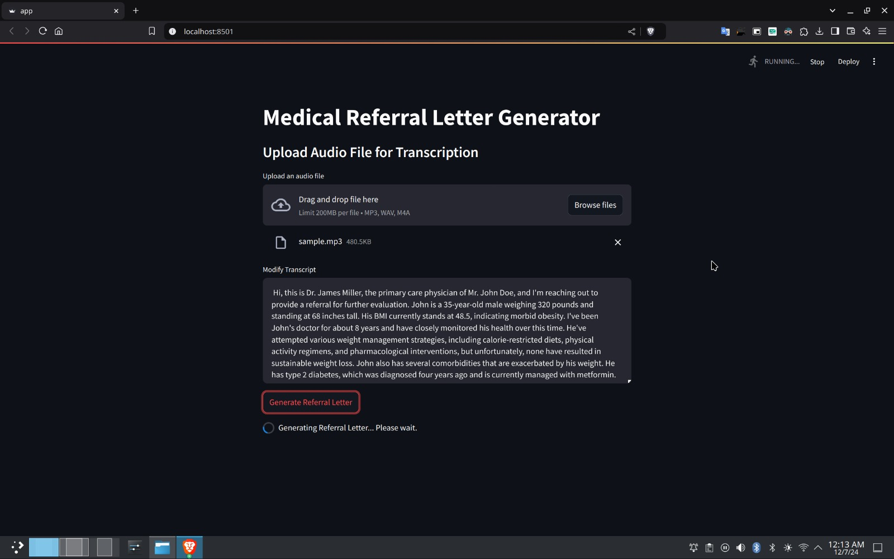
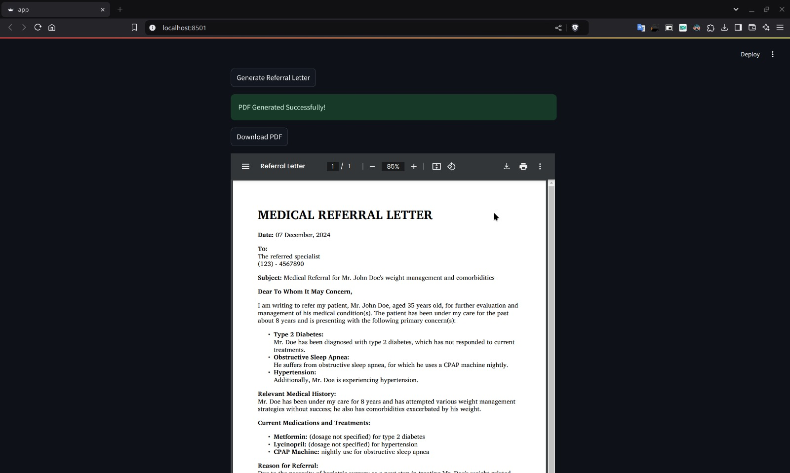

# Medical Referral Letter Generator

This project is an LLM-based application that helps medical professionals generate referral letters automatically. It transcribes audio files (like doctor-patient conversations) into text using OpenAI's Whisper model, extracts necessary details from the transcript, and generates a referral letter in PDF format.

## Libraries and Technologies Used

The project uses the following libraries and technologies:

- **Streamlit**: For building the interactive web interface.
- **Whisper**: An automatic speech recognition (ASR) model by OpenAI for transcribing audio to text.
- **llama3.1**: An AI model for generating the referral letter based on the extracted information.

## Output Example

Here is an example of the generated output:

## How the Project Works

1. **Audio Upload**: The user uploads an audio file of a doctor-patient conversation.
2. **Transcription**: The audio file is transcribed into text using the Whisper model. This transcription serves as the input for generating the referral letter.
3. **Transcript Editing**: The transcribed text is displayed in an editable text area where the user can modify or correct the content.
4. **Referral Letter Generation**: Once the transcript is ready, the user clicks the "Generate Referral Letter" button. The system generates a professional referral letter based on the provided transcript and doctor's information.
5. **PDF Generation**: The generated referral letter is then converted into a PDF document, which the user can download.
6. **PDF Preview**: The PDF is displayed inline, so the user can preview the referral letter before downloading.

## User Interface

Here are some images showcasing the user interface:

1. **Audio File Upload and Transcript Modification**  
   

2. **Displaying Generated PDF**  
   

